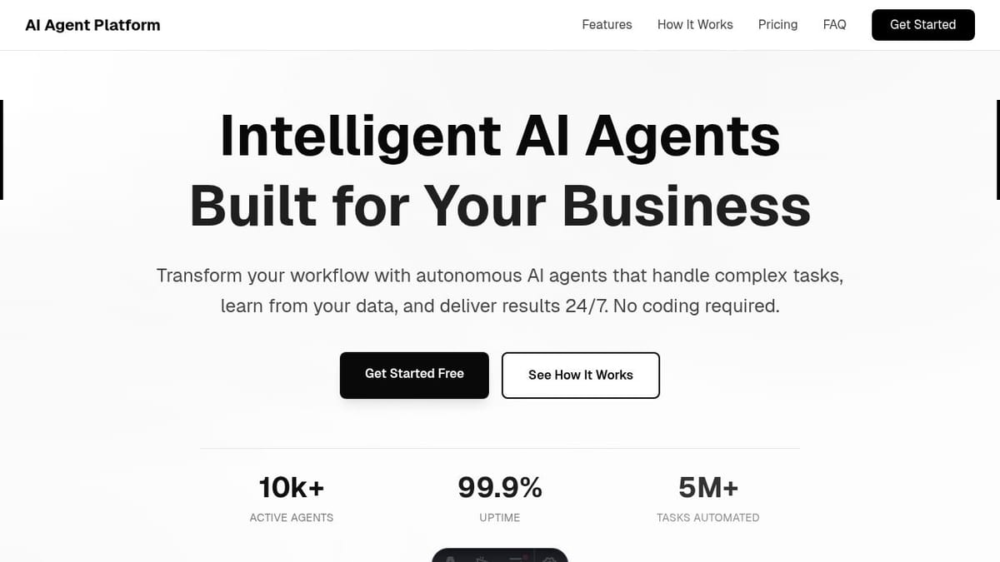

# AI Agent Landing Page



A modern, production-ready landing page template for AI and SaaS products. Built with Astro and Tailwind CSS.

## Features

- ⚡️ **Astro 5** - Fast, static site generation
- 🎨 **Tailwind CSS 4** - Modern styling with CSS-first config
- 📱 **Fully Responsive** - Mobile-first design
- ♿ **Accessible** - Semantic HTML & ARIA compliant
- 🎭 **Smooth Animations** - Scroll-triggered effects
- 🎯 **SEO Ready** - Meta tags & Open Graph
- 🧩 **Modular Components** - Easy to customize

## Sections

- Hero with stats
- Features grid (9 cards)
- How it works (4 steps)
- Testimonials (6 with company logos)
- Pricing tiers (3 plans)
- FAQ accordion (6 questions)
- Contact form
- Footer

## Quick Start

```bash
# Install dependencies
npm install

# Start dev server
npm run dev

# Build for production
npm run build
```

## Customization

Edit content in:

- `src/config.ts` - Site configuration
- `src/content/*.ts` - Features, testimonials, FAQ
- `src/styles/globals.css` - Colors & animations

## Deploy

[](https://vercel.com/new)

Works on Replit, Vercel, Netlify, and GitHub Pages.

## License

[MIT](LICENSE)
